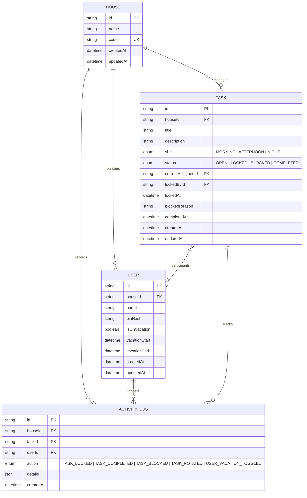

# DOMUS - Especificação Técnica Oficial (Blueprint)

> **Documento Vivo de Arquitetura e Regras de Negócio do Backend**  
> *Versão:* 1.0.0  
> *Status:* Aprovado (Sprint 1 - Foundation & Blueprint)

---

## 1. Objetivo do Sistema
O **DOMUS** é uma plataforma de gestão doméstica inteligente e colaborativa projetada para coordenar a convivência, distribuição de responsabilidades e rotinas operacionais de uma residência/república. O sistema automatiza a escala de tarefas domésticas, garante previsibilidade de turnos, evita sobrecarga individual e resolve conflitos de concorrência por meio de um algoritmo determinístico de rodízio seletivo e lock de execução.

---

## 2. Fluxo de Acesso e Autenticação (2FA Doméstico)
Para garantir isolamento de dados entre residências e simplicidade de uso em dispositivos compartilhados (ex: tablets na cozinha) e pessoais (smartphones), a autenticação opera em duas etapas mandatórias:

```
[Etapa 1: Household Code] ──▶ [Etapa 2: Seleção de Usuário + PIN] ──▶ [JWT Session Token]
```

1. **Fator 1 - Código da Residência (`House Code`):**
   - Código alfanumérico único da residência (ex: `DOMUS-789X`).
   - Identifica o tenant/espaço doméstico e carrega a lista pública de membros daquela casa (nomes e avatares).
2. **Fator 2 - Login Individual com PIN:**
   - O membro seleciona seu perfil e insere seu PIN numérico (4 a 6 dígitos).
   - O PIN é validado no backend contra hash criptográfico seguro (Argon2 / Bcrypt).
3. **Emissão de Sessão:**
   - Emissão de JSON Web Token (JWT) contendo `userId`, `houseId` e permissões no payload.
   - Toda requisição subsequente deve conter o header `Authorization: Bearer <token>`.
   - O backend valida a pertença do usuário à casa em cada operação (RBAC / Tenancy Isolation).

---

## 3. Máquina de Estados da Tarefa (`Task Lifecycle`)

### 3.1 Estados da Tarefa
* **`OPEN`:** Tarefa disponível para o turno atual. O responsável da vez (`currentAssigneeId`) é indicado pelo rodízio, mas qualquer participante elegível pode assumir.
* **`LOCKED`:** A tarefa foi assumida por um usuário (`lockedById`) para execução imediata. Bloqueada para outros membros por até 45 minutos.
* **`BLOCKED`:** A tarefa não pôde ser executada devido a um impedimento físico ou logístico (ex: falta de produto de limpeza, quebra de equipamento). Exige registro de motivo (`blockedReason`).
* **`COMPLETED`:** A tarefa foi finalizada com sucesso. Dispara a rotação automática do próximo responsável e registra auditoria.

### 3.2 Turnos Operacionais (`Shifts`)
Cada tarefa pertence a um turno específico do dia:
* **`MORNING` (Manhã):** 06:00 - 12:00
* **`AFTERNOON` (Tarde):** 12:00 - 18:00
* **`NIGHT` (Noite):** 18:00 - 23:59

### 3.3 Botões de Ação na Interface (Contratos da API)
A interface expõe 3 ações primárias para manipulação do estado da tarefa:

1. **`[ Iniciar / Lock ]` (`POST /api/tasks/:id/lock`):**
   - Transiciona a tarefa de `OPEN` ou `BLOCKED` para `LOCKED`.
   - Registra `lockedById = req.userId` e `lockedAt = new Date()`.
   - Inicia o temporizador de concorrência de 45 minutos.
2. **`[ Concluir / Done ]` (`POST /api/tasks/:id/complete`):**
   - Transiciona a tarefa de `LOCKED` (ou `OPEN`) para `COMPLETED`.
   - Registra `completedAt = new Date()`.
   - Dispara imediatamente o **Algoritmo de Rodízio Seletivo** para definir o próximo `currentAssigneeId` do próximo ciclo.
   - Limpa `lockedById`, `lockedAt` e `blockedReason`.
3. **`[ Reportar Impedimento / Block ]` (`POST /api/tasks/:id/block`):**
   - Transiciona a tarefa para `BLOCKED`.
   - Exige payload `{ reason: string }`.
   - Libera o lock (`lockedById = null`, `lockedAt = null`).
   - Notifica a casa e registra em `ActivityLog`.

---

## 4. Algoritmo de Rodízio Seletivo (`Selective Rotation Algorithm`)

O rodízio do DOMUS não é estático nem global. Cada tarefa possui seu próprio grupo de participantes designados no momento da criação.

### 4.1 Regras de Ordenação e Pool de Participantes
1. **Pool Exclusivo (`participantIds`):**
   - Uma tarefa pode incluir um subconjunto de membros (ex: Lavar Banheiro: apenas Alice e Bruno; Lavar Louça: Alice, Bruno, Carlos e Daniel).
2. **Ordenação Canônica (A-Z):**
   - Os membros do pool são ordenados deterministicamente por ordem alfabética do nome cadastrado.
   - A lista de IDs é indexada: `[P_0, P_1, P_2, ..., P_N-1]`.
3. **Inserção Alfabética:**
   - Caso um novo participante seja adicionado à tarefa posteriormente, ele é inserido em sua respectiva posição alfabética sem reiniciar o histórico.

### 4.2 Lógica de Rotação e Salto de Férias (`Vacation Skip`)
Ao concluir uma tarefa (`POST /tasks/:id/complete`) ou ao avançar o ciclo:

$$\text{next\_index} = (\text{current\_index} + 1) \pmod N$$

**Tratamento de Férias (`isOnVacation`):**
1. O backend busca o participante na posição `next_index`.
2. Se `user.isOnVacation === true` (ou data atual contida entre `vacationStart` e `vacationEnd`):
   - O usuário é saltado (*skipped*).
   - Um log de auditoria é emitido: `TASK_ROTATED (Skipped user on vacation)`.
   - O algoritmo incrementa `next_index = (next_index + 1) % N` e repete a verificação.
3. Se **todos** os participantes do pool estiverem de férias:
   - A tarefa permanece atribuída ao primeiro da lista, mas entra em alerta para a residência.

---

## 5. Lock de Execução e Concorrência (`Execution Lock`)

Para evitar que duas pessoas comecem a realizar a mesma tarefa em paralelo (conflito de esforço duplicado):

### 5.1 Regras de Concorrência
1. **Exclusividade:** Apenas um usuário pode deter o lock de uma tarefa por vez.
2. **Timeout Rígido de 45 Minutos:**
   - Duração padrão: $T_{\text{lock}} = 45 \text{ minutos}$.
   - Se $\text{now} - \text{task.lockedAt} > 45 \text{ min}$, o lock é considerado expirado (*stale lock*).
3. **Liberação / Reivindicação:**
   - Se um lock expirou sem que a tarefa tenha sido completada, a tarefa pode ser reivindicada por outro usuário ou reassumida pelo mesmo.
   - O backend recalcula o status dinamicamente em queries de leitura e nas tentativas de lock:
     ```typescript
     if (task.status === 'LOCKED' && isLockExpired(task.lockedAt, 45)) {
       task.status = 'OPEN';
       task.lockedById = null;
       task.lockedAt = null;
     }
     ```
4. **Proteção Transacional:**
   - A aquisição de lock deve ocorrer via transação atômica (`SELECT FOR UPDATE` ou atualização condicional `WHERE status = 'OPEN' OR (status = 'LOCKED' AND locked_at < :expiredThreshold)`).

---

## 6. Entidades Principais e Esquema de Dados



### 6.1 Detalhamento das Entidades
* **`House`:** Representa a unidade doméstica (Tenant). Possui código de entrada compartilhado.
* **`User`:** Membro da casa. Contém credencial PIN protegida por hash e controle de ausência temporária (férias).
* **`Task`:** Tarefa doméstica com turno, pool de participantes, estado em tempo real e controle de concorrência.
* **`ActivityLog`:** Tabela imutável de eventos para auditoria, histórico de bloqueios e relatórios de produtividade.

---

## 7. Diretrizes para a Sprint 2 (Modelagem de Banco de Dados)
Na Sprint 2, este documento servirá como base estrita para:
1. Criação do arquivo `schema.prisma` com os relacionamentos `1:N` e `N:N` (tabela associativa `TaskParticipant`).
2. Configuração de migrations e seeds com massa de dados de teste (membros, turnos e tarefas com rodízio ativo).
3. Implementação dos repositórios tipados na camada `src/infra/database/`.
