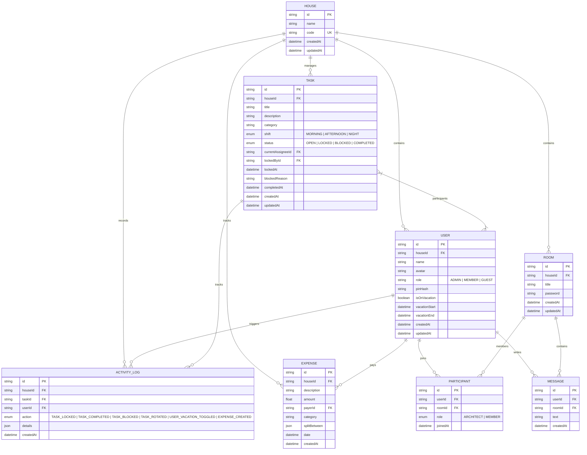

# Modelo de Dados & Entidades Canônicas

## 1. Diagrama Entidade-Relacionamento (ERD)

---

## 2. Dicionário de Entidades

### 2.1 `House` (Tenant)
Representa a residência. Fornece isolamento multi-tenant via `houseId`. O `code` é alfanumérico único para o login inicial compartilhado (ex: `DOMUS-892`).

### 2.2 `User` (Membro)
Membro vinculado à residência. Autenticado por seleção de perfil + PIN de 4 a 6 dígitos. Possui flags de ausência/férias que influenciam o algoritmo de rotação de tarefas.

### 2.3 `Room` (Sala de Comunicação / Chat)
Sala de convivência ou gestão protegida por senha criptografada (hash Bcrypt). Possui criador e múltiplos participantes.

### 2.4 `Participant` (Associação com Papel / Role)
Tabela associativa entre `User` e `Room` contendo o cargo específico do usuário na sala (`ARCHITECT` ou `MEMBER`).

### 2.5 `Message` (Mensagem)
Registro de mensagens trocadas dentro de uma sala por participantes autorizados.

### 2.6 `Task` (Tarefa Doméstica)
Item operacional com ciclo de vida com controle de concorrência (`OPEN` ➔ `LOCKED` ➔ `COMPLETED` ou `BLOCKED`).

### 2.7 `Expense` (Despesa Compartilhada)
Registro financeiro da residência para controle de caixa comum, divisão proporcional ou igualitária entre moradores.

### 2.8 `ActivityLog` (Auditoria Imutável)
Histórico cronológico de ações executadas no sistema para geração de relatórios de produtividade, auditoria de bloqueios e transparência.
