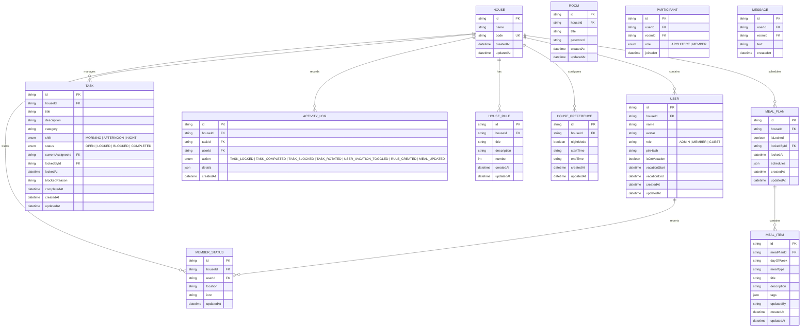

# Modelo de Dados & Entidades Canônicas

## 1. Diagrama Entidade-Relacionamento (ERD)

---

## 2. Dicionário de Entidades

### 2.1 `House` (Tenant)
Representa a residência. Fornece isolamento multi-tenant via `houseId`. O `code` é alfanumérico único para o login inicial compartilhado (ex: `CASA-4821`).

### 2.2 `User` (Membro)
Membro vinculado à residência. Autenticado por credenciais JWT e PIN seguro. Possui flags de ausência/férias que influenciam o algoritmo de rotação de tarefas.

### 2.3 `Room` (Sala de Comunicação / Chat)
Sala de convivência ou gestão protegida por senha criptografada (hash Bcrypt). Possui criador e múltiplos participantes.

### 2.4 `Participant` (Associação com Papel / Role)
Tabela associativa entre `User` e `Room` contendo o cargo específico do usuário na sala (`ARCHITECT` ou `MEMBER`).

### 2.5 `Message` (Mensagem)
Registro de mensagens trocadas dentro de uma sala por participantes autorizados.

### 2.6 `Task` (Tarefa Doméstica)
Item operacional com ciclo de vida com controle de concorrência (`OPEN` ➔ `LOCKED` ➔ `COMPLETED` ou `BLOCKED`). Possui visibilidade universal para todos os moradores da residência (`house_id`), mesmo recém-chegados.

### 2.7 `HouseRule` (Regras da Convivência)
Regras operacionais e diretrizes éticas da residência persistidas no PostgreSQL (`title`, `description`, `number`).

### 2.8 `HousePreference` (Configurações Gerais da Casa)
Preferências compartilhadas da casa, como horário de início e fim do modo noturno (`night_mode`, `start_time`, `end_time`).

### 2.9 `MealPlan` e `MealItem` (Cardápio Semanal)
Cardápio da residência estruturado por dia da semana e período de refeição (`breakfast`, `lunch`, `snack`, `dinner`), com suporte a bloqueio por Administrador Geral (`is_locked`) e horários customizados.

### 2.10 `MemberStatus` (Onde Estou / Status do Morador)
Status operacional e de presença do morador no momento (`location`, `icon`), compartilhado em tempo real e persistido no PostgreSQL.

### 2.11 `ActivityLog` (Auditoria Imutável)
Histórico cronológico de ações executadas no sistema para geração de relatórios de produtividade, auditoria de bloqueios e transparência universal entre todos os moradores.
