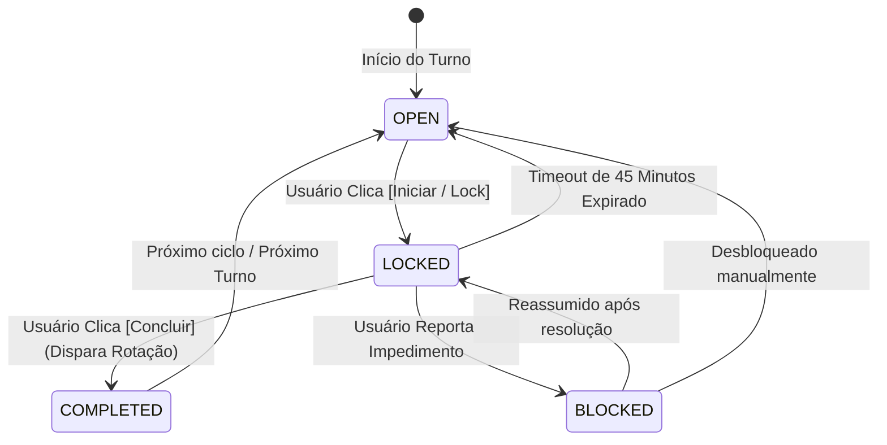

# Módulo: Tarefas & Rodízio Seletivo

## 1. Ciclo de Vida da Tarefa
O estado da tarefa segue a máquina de estados abaixo:

---

## 2. Turnos Operacionais
- **Manhã (`MORNING`):** 06:00 às 12:00
- **Tarde (`AFTERNOON`):** 12:00 às 18:00
- **Noite (`NIGHT`):** 18:00 às 23:59

---

## 3. Regras de Negócio do Rodízio
1. **Participantes Específicos:** Cada tarefa é configurada com seu próprio pool de membros.
2. **Ordem Alfabética Canônica:** Determinação estrita da fila de vez por ordem alfabética.
3. **Salto de Férias:** Membros com `isOnVacation = true` são automaticamente pulados na conclusão da tarefa, registrando log de auditoria do salto.
