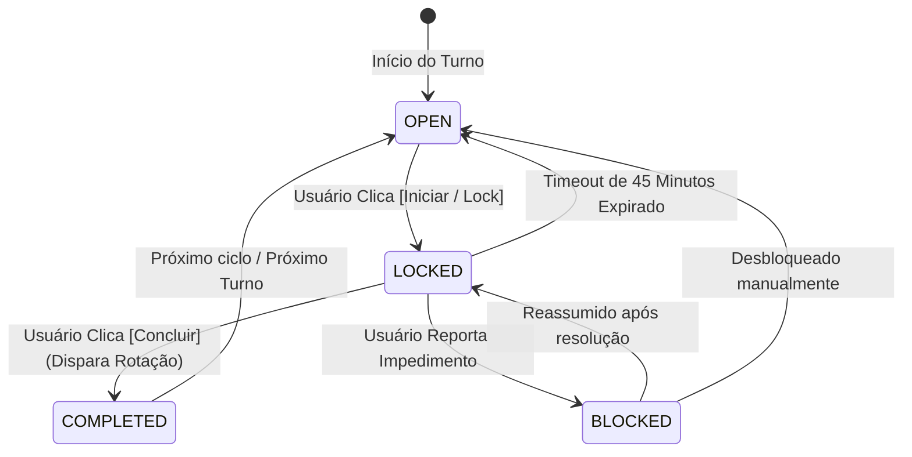

# Módulo: Tarefas & Rodízio Seletivo

## 1. Ciclo de Vida da Tarefa
O estado da tarefa segue a máquina de estados abaixo:

---

## 2. Turnos Operacionais
- **Manhã (`MORNING`):** 06:00 às 12:00
- **Tarde (`AFTERNOON`):** 12:00 às 18:00
- **Noite (`NIGHT`):** 18:00 às 23:59

---

## 3. Regras de Negócio do Rodízio
1. **Participantes Específicos:** Cada tarefa é configurada com seu próprio pool de membros.
2. **Ordem Alfabética Canônica:** Determinação estrita da fila de vez por ordem alfabética.
3. **Salto de Férias:** Membros com `isOnVacation = true` são automaticamente pulados na conclusão da tarefa, registrando log de auditoria do salto.

---

## 4. Regras de Permissão & Governança

### 4.1 Conclusão de Tarefas
- **Tarefa Direcionada:** Apenas o morador designado (`tarefa.responsavelId === usuarioAtual.id`).
- **Tarefa de Rodízio:** Apenas o morador da vez no turno (`rodizio.membroAtualId === usuarioAtual.id`, ordem A-Z com salto de férias).
- **Violação (403 Forbidden):** Bloqueio estrito no backend e botão desabilitado em cinza no frontend com tooltip: `"Aguardando confirmação de [Nome do Responsável]"`.

### 4.2 Reversão / Cancelamento de Tarefas Concluídas
- **Quem pode executar:** Exclusivo para o **Admin Geral** e **Sub-Admins** (`role === 'ADMIN' | 'SUB_ADMIN'`).
- **Moradores comuns:** Visualizam apenas o selo verde `"Concluída"`, sem botões de ação ou intervenção.
- **Confirmação:** Exige modal de confirmação antes do disparo da requisição à API.

### 4.3 Gestão e Adição de Membros
- **Regra Estrita:** Nenhum morador comum pode convidar ou adicionar novos membros à residência.
- **Autoridade Permitida:** Apenas o **Admin Geral** e os **Sub-Admins** possuem acesso às telas e ações de cadastro de novos moradores.
