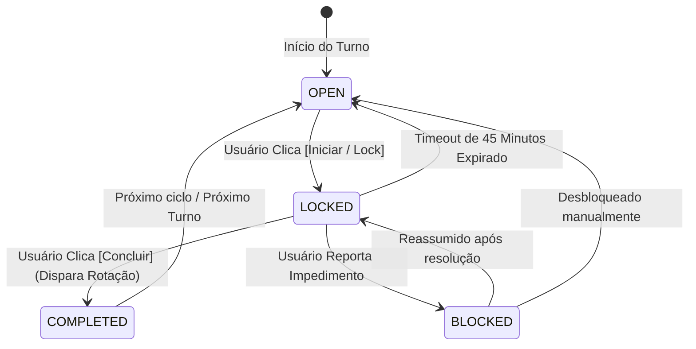

# Módulo: Tarefas & Rodízio Seletivo

## 1. Ciclo de Vida da Tarefa
O estado da tarefa segue a máquina de estados abaixo:

---

## 2. Turnos Operacionais
- **Manhã (`MORNING`):** 06:00 às 12:00
- **Tarde (`AFTERNOON`):** 12:00 às 18:00
- **Noite (`NIGHT`):** 18:00 às 23:59

---

## 3. Regras de Negócio do Rodízio
1. **Participantes Específicos:** Cada tarefa é configurada com seu próprio pool de membros.
2. **Ordem Alfabética Canônica:** Determinação estrita da fila de vez por ordem alfabética.
3. **Salto de Férias:** Membros com `isOnVacation = true` são automaticamente pulados na conclusão da tarefa, registrando log de auditoria do salto.

---

## 4. Regras de Permissão & Governança

### 4.1 Conclusão de Tarefas
- **Regra Universal:** Em todo o aplicativo, **nenhum morador pode concluir tarefas que não sejam suas**, com a **exclusiva exceção do Admin Geral** (`role === 'ADMIN' | 'Admin Geral'`).
- **Tarefa Direcionada:** Apenas o morador designado (`tarefa.responsavelId === usuarioAtual.id`) ou o Admin Geral.
- **Tarefa de Rodízio:** Apenas o morador da vez no turno (`rodizio.membroAtualId === usuarioAtual.id`, ordem A-Z com salto de férias) ou o Admin Geral.
- **Violação (403 Forbidden):** Bloqueio estrito no backend e botão desabilitado em cinza no frontend (tanto na tela de tarefas quanto no Drawer de Alertas/Notificações) com tooltip: `"Aguardando confirmação de [Nome do Responsável]"`.

### 4.2 Reversão / Cancelamento de Tarefas Concluídas
- **Quem pode executar:** Exclusivo para o **Admin Geral** e **Sub-Admins** (`role === 'ADMIN' | 'SUB_ADMIN'`).
- **Moradores comuns:** Visualizam apenas o selo verde `"Concluída"`, sem botões de ação ou intervenção.
- **Confirmação:** Exige modal de confirmação antes do disparo da requisição à API.

### 4.3 Gestão e Adição de Membros
- **Regra Estrita:** Nenhum morador comum pode convidar ou adicionar novos membros à residência.
- **Autoridade Permitida:** Apenas o **Admin Geral** e os **Sub-Admins** possuem acesso às telas e ações de cadastro de novos moradores.

### 4.4 Edição de Escala de Rodízio & Preservação da Vez
- **Autoridade Permitida:** Exclusivo para **Admin Geral** e **Sub-Admins** (`role === 'ADMIN' | 'SUB_ADMIN'`). Moradores comuns recebem HTTP 403 Forbidden no backend e não visualizam botões de edição no frontend.
- **Motor de Preservação de Escala (`Rotation-Preserving Engine`):**
  1. Ao salvar alterações nos participantes de uma tarefa de rodízio, o sistema identifica quem é o morador com a vez ativa (`currentAssigneeId`).
  2. Ordena a nova lista de participantes em ordem alfabética canônica (A-Z).
  3. Se o morador atual permanece na nova lista, seu índice na lista reordenada é atribuído ao `rotation_index`, garantindo que **a pessoa da vez não perca seu turno** mesmo com a adição de participantes anteriores na ordem alfabética.
  4. Se o morador atual foi excluído da lista, o `rotation_index` avança de forma suave e circular para o próximo sucessor na sequência que permaneça ativo.
  5. Moradores em modo férias (`vacation_mode: true`) são pulados automaticamente na determinação da vez ativa (`isNext: true`), sendo identificados na interface com o badge `🏖️ Férias (fora da escala ativa)`.

### 4.5 Giro da Escala de Rodízio (`onRotateNext` / `POST /api/tasks/:id/rotate`)
- **Regra de Autoridade Estrita:** Apenas o morador que atualmente detém a vez ativa (`isNext === true`) tem autorização para girar o rodízio.
- **Comportamento Visual (Frontend):** Moradores fora da sua vez (ou membros que não pertençam à escala) visualizam o botão desabilitado em cinza com ícone de cadeado (`lock`) e tooltip informativo: `"Aguardando a vez de [Nome do Morador da Vez]"`.
- **Bloqueio Backend (403 Forbidden):** Qualquer chamada à rota `POST /api/tasks/:id/rotate` executada por usuário que não seja o responsável da vez é rejeitada com status HTTP 403 e código `FORBIDDEN_TASK_ROTATION`.

### 4.6 Expiração Diária Automática & Avanço com Penalidade (Opção A)
- **Ciclo de Expiração:** Na virada do ciclo (meia-noite / 00:00), tarefas diárias pendentes têm sua expiração processada.
- **Impacto no Responsável:** É registrado um log `FAILED` no histórico do morador responsável inadimplente, impactando negativamente seu scorecard pessoal e a métrica de "Saúde da Convivência".
- **Comportamento em Rodízio (Opção A):** O `rotation_index` avança imediatamente e de forma circular para o próximo participante ativo da fila (ordem A-Z com salto de férias), garantindo que a residência não fique desassistida e as rotinas não travem.
- **Tarefas Diárias Comuns:** O ciclo anterior é encerrado com registro `FAILED` e uma nova instância limpa é iniciada para a nova jornada.

### 4.7 Prerrogativa do Admin Geral: Perdoar Falha (`POST /api/tasks/:id/forgive-failure`)
- **Autoridade:** Exclusiva do Admin Geral (`ADMIN` ou `Admin Geral`).
- **Comportamento:** Remove a penalidade da falha registrada em caso de imprevisto, doença ou ausência justificada, recalculando as métricas de harmonia da residência.

### 4.8 Visibilidade Universal de Tarefas e Histórico
- **Regra Fundamental de Convivência:** Todas as tarefas da residência (`house_id`), seus respectivos rodízios, status de conclusão e registros de histórico são **universalmente visíveis por todos os moradores da casa**, sem exceção.
- **Moradores Novos / Recém-Cadastrados:** Ao ingressar na residência com o código de convite, o novo morador tem acesso imediato à visualização de todas as tarefas já criadas (passadas, em andamento ou futuras) e seus históricos, antes mesmo de ser incluído como participante ativo de alguma escala pelo Admin.
- **Moradores Não-Participantes:** Um morador que não faça parte do pool de participantes de uma tarefa específica continua visualizando normalmente o card da tarefa, o responsável atual e o histórico, garantindo plena transparência e harmonia operacional na convivência compartilhada.

